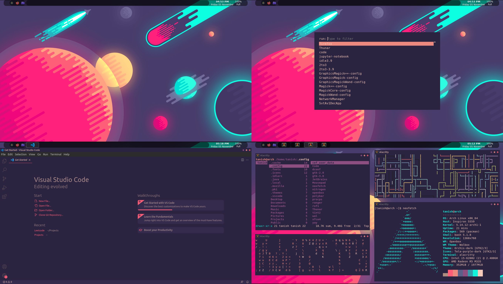

# Dotfiles

## [1](1/)
- **Distro:** Arch Linux
- **WM:** i3wm
- **Panel:** Polybar
- **App Launcher:** Rofi
- **Lockscreen:** i3lock-color
- **Color Scheme:** Pywal

## [2](2/)
- **Distro:** Arch Linux
- **WM:** Openbox
- **Panel:** Tint2
- **App Launcher:** Rofi
- **Color Scheme:** Pywal

